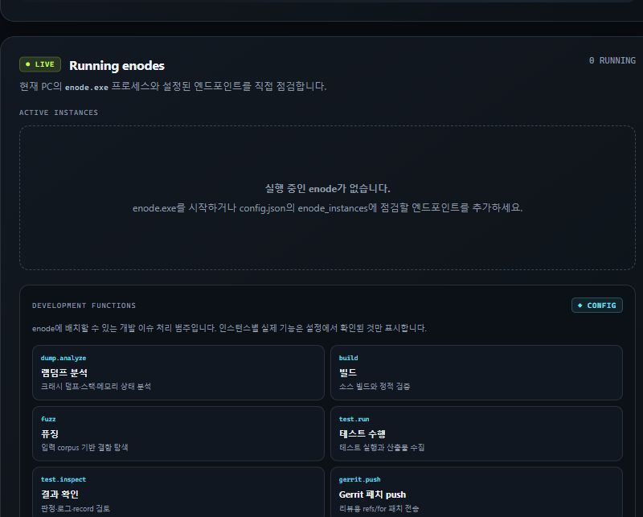
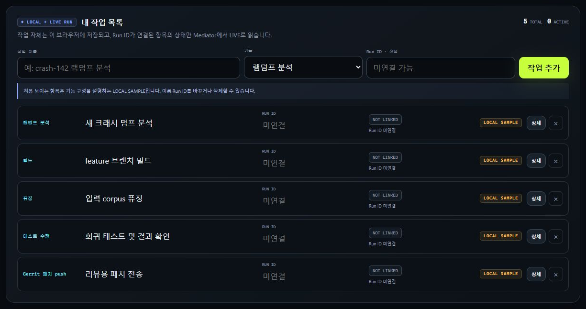
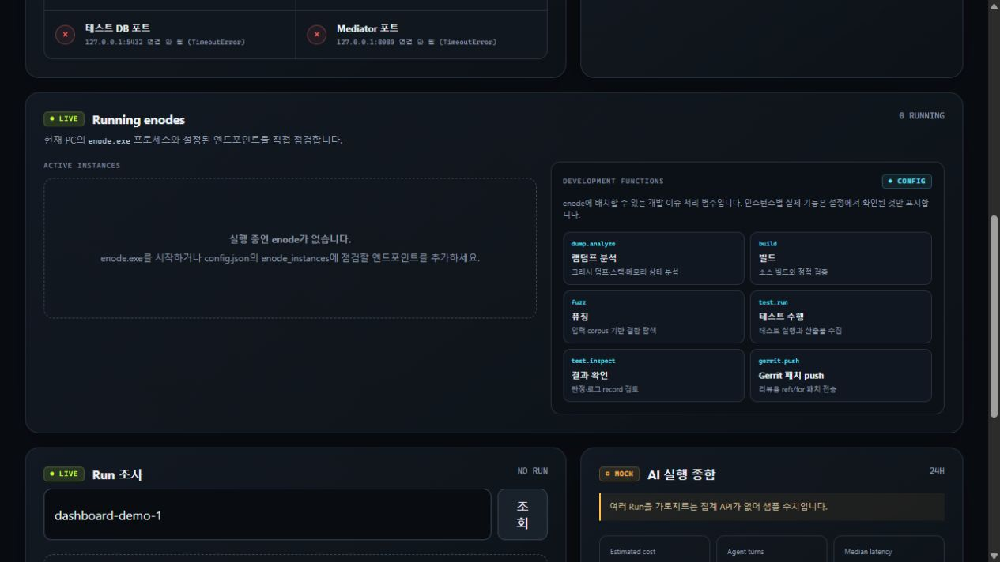
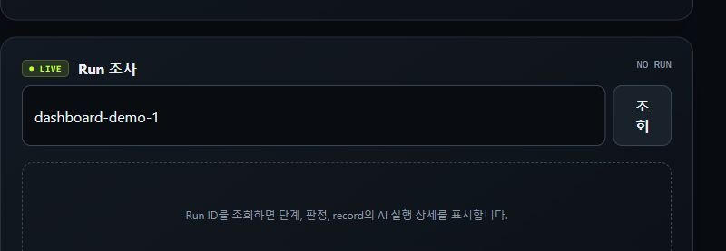
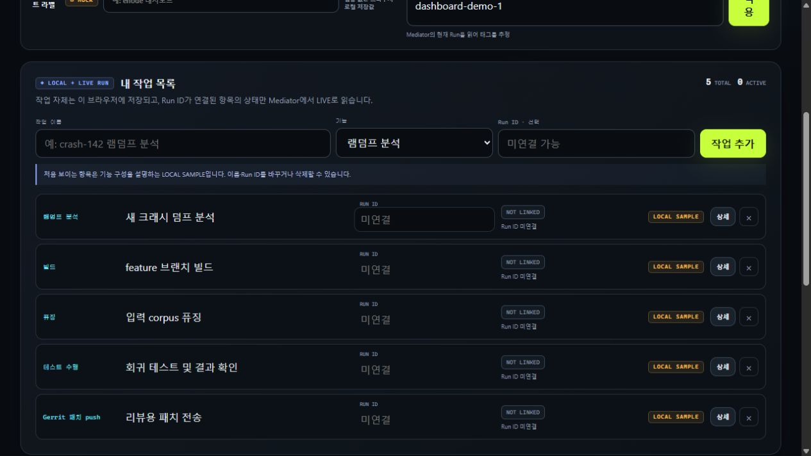
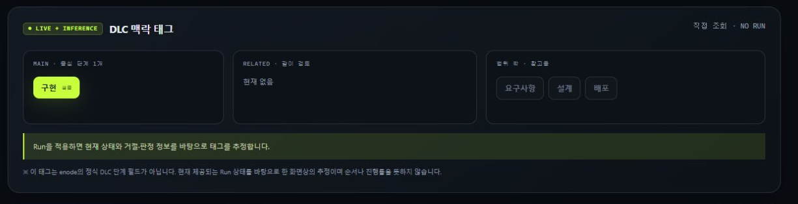
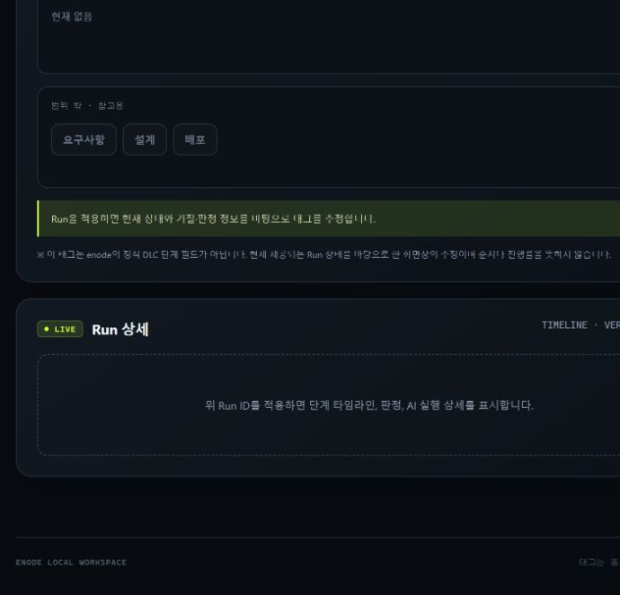

# enode 로컬 대시보드

Python 표준 라이브러리만 사용하는 운영·사용자 대시보드입니다. 브라우저는 이 서버만 호출하고, 서버가 Bearer 토큰을 보관한 채 Mediator를 대신 호출합니다.

## GitHub에서 바로 보기

[샘플 화면 페이지 열기](SAMPLE.md)에서 운영 화면과 사용자 화면을 실행 없이 바로 확인할 수 있습니다.

[](SAMPLE.md#운영-화면)

[](SAMPLE.md#사용자-화면)

## 설계에 맞춘 운영 기능

- 운영 화면의 `Fleet nodes`: Mediator의 `GET /v1/nodes`에서 만료 전 advertisement와 응답 시점의 lease를 LIVE로 관측
- 작업 템플릿: 램덤프 분석, 빌드, 퓨징, 테스트 수행·결과 확인, Gerrit 패치 push를 사용자 작업 생성용 범주로 제공
- 사용자 화면의 `내 작업 목록`: 작업 이름·종류·Run ID를 브라우저에 로컬 저장하고, 연결된 Run 상태를 Mediator에서 갱신
- 정식 Run 상태: `RESOLVING`, `ALLOCATING`, `RUNNING`, `VERIFYING`, `SUCCEEDED`, `FAILED`
- 로컬 UI 상태: `NOT LINKED`, `CHECKING`, `OFFLINE`은 Run 상태와 구분

`GET /v1/nodes`는 운영 관측용입니다. `free`, `available`, 순위나 배정 가능성을 제공하지 않으며, 실제 배정 판단은 Run dry-run 또는 생성 요청만 수행합니다. 로컬 `enode` 프로세스 수는 Mediator 관측과 별도의 진단 정보로만 표시합니다.

## 화면 미리보기

실행 없이 현재 결과를 확인할 수 있습니다.

### 운영 화면



#### 부분 화면 1 — Fleet nodes 관측


이 영역은 운영자가 **Mediator가 현재 관측하는 enode 광고와 lease**를 한눈에 확인하는 곳입니다.

- **ACTIVE ADVERTISEMENTS**: 만료되지 않은 node advertisement만 표시합니다. 각 행에는 node ID, label, instance, capability와 attrs, 관측된 lease가 포함됩니다.
- **LEASE OBSERVED**: 응답 시점에 해당 노드와 연결된 lease가 보였다는 뜻입니다. 이후의 배정 가능성이나 실제 liveness를 보장하지 않습니다.
- **WORK TEMPLATES**: 램덤프 분석·빌드·퓨징·테스트·Gerrit push는 사용자 작업을 분류하는 템플릿입니다. 노드가 광고하는 정식 capability인 `agent.reason`과 혼동하지 않습니다.
- **로컬 진단**: 이 PC의 `enode` 프로세스 수는 문제 조사 힌트일 뿐이며, 클러스터 노드 목록이나 스케줄링 근거로 사용하지 않습니다.

#### 부분 화면 2 — Run 조사



이 영역은 하나의 개발 작업 실행을 `Run ID`로 추적하는 진입점입니다.

- Run ID를 입력하고 **조회**하면 Mediator에서 정식 Run 상태, 단계 타임라인, 거절 사유, 최종 판정, record의 AI 실행 정보를 읽습니다.
- 우측 상태의 `NO RUN`은 아직 유효한 Run을 읽지 못했다는 뜻입니다. Mediator가 오프라인이어도 화면 전체를 멈추지 않고 해당 LIVE 조회만 실패로 표시합니다.
- 운영자는 어느 단계에서 멈췄는지와 실패 시 먼저 확인할 record·로그를 결정할 수 있습니다.

### 사용자 화면



#### 부분 화면 1 — 내 작업 목록


이 영역은 사용자가 램덤프 분석, 빌드, 퓨징, 테스트, 결과 확인, Gerrit 패치 push 같은 **개인 개발 작업을 한 목록에서 관리**하는 곳입니다.

- 각 항목에는 작업 이름, 작업 템플릿, 선택적인 Run ID가 있으며 이름과 Run ID는 목록에서 바로 수정할 수 있습니다.
- 목록은 브라우저 로컬 저장소에 보관되며 `LOCAL SAMPLE`, `LOCAL`, `LIVE RUN`으로 출처를 표시합니다.
- Run ID가 없으면 `NOT LINKED`, 조회 중에는 `CHECKING`, 연결 후에는 정식 상태 `RESOLVING`, `ALLOCATING`, `RUNNING`, `VERIFYING`, `SUCCEEDED`, `FAILED` 중 하나를 표시합니다.
- 통신 실패인 `OFFLINE`은 로컬 UI 상태이지 Mediator Run 상태가 아닙니다.

#### 부분 화면 2 — DLC 맥락 태그



이 영역은 선택한 Run의 상태·거절·판정 정보를 바탕으로 지금 검토해야 할 개발 수명주기 맥락을 정리합니다.

- `MAIN`은 중심 맥락, `RELATED`는 함께 확인할 맥락, `범위 밖`은 직접 대상이 아닌 참고 영역입니다.
- 태그는 진행률이나 enode의 정식 DLC 단계가 아니라 현재 Run을 화면에서 해석한 `LIVE + INFERENCE`입니다.

#### 부분 화면 3 — Run 상세



이 영역은 선택한 작업의 실행 근거를 사용자가 직접 확인하는 곳입니다.

- Run을 적용하면 단계별 타임라인, 최종 판정, harness와 record의 AI 실행 상세가 표시됩니다.
- 안내 문구만 보이면 적용된 Run이 없거나 LIVE 데이터를 읽지 못한 상태입니다. 샘플 성공 결과로 채우지 않아 실제 연결 상태와 혼동되지 않게 했습니다.

## 실행

```powershell
$env:ENODE_MEDIATOR_TOKEN = "dev-dashboard-token"
python .\server.py
```

- 운영 화면: <http://127.0.0.1:8765/>
- 내 작업: <http://127.0.0.1:8765/me>

## 설정

`config.json`에서 Mediator 주소·토큰, enode 바이너리 경로, 노드 설정 후보 경로, Postgres 호스트·포트를 바꿀 수 있습니다. 환경변수 `ENODE_MEDIATOR_URL`, `ENODE_MEDIATOR_TOKEN`, `ENODE_PRINCIPAL`, `ENODE_DASHBOARD_HOST`, `ENODE_DASHBOARD_PORT`, `ENODE_DASHBOARD_CONFIG`, `ENODE_BIN_DIR`, `ENODE_GO_PATHS`, `ENODE_NODE_CONFIG_PATHS`, `ENODE_DATABASE_HOST`, `ENODE_DATABASE_PORT`가 같은 항목보다 우선합니다. 여러 경로 환경변수는 Windows에서 세미콜론으로 구분합니다.

토큰을 외부에 공유하거나 저장소에 커밋하지 마세요. 현재 `dev-dashboard-token`은 로컬 데모 기본값이며 운영 환경에서는 환경변수로 교체해야 합니다.

## 데이터 신뢰성

- LIVE OBSERVATION: `GET /v1/nodes`의 만료 전 광고와 응답 시점 lease. liveness 또는 배정 가능성 보장 아님
- LIVE: PC 셋업 점검, Mediator capability, Run과 record tar, Ask 인박스, git 이메일
- LOCAL DIAGNOSTIC: 현재 PC의 `enode` 프로세스 수
- LOCAL + LIVE RUN: 내 작업 목록은 브라우저에 저장하고 Run ID가 있는 항목만 Mediator에서 조회
- TEMPLATE: 개발 작업 생성 범주. 노드 capability가 아님
- MOCK: 여러 Run을 가로지르는 AI 누적 집계, 사용자가 로컬에 저장하는 프로젝트 라벨

Mediator가 꺼져 있어도 웹 서버와 화면은 유지되고 각 LIVE 패널에 연결 실패가 표시됩니다.

## 현재 검증 상태

- enode의 `mediator`, `enode`, `runctl`, `enodectl` Windows 빌드 성공
- 실제 `enode.exe` 기동과 광고·claim 재시도 로그 확인
- Python 및 JavaScript 문법 검사, 변경 Go 패키지 테스트·빌드 수행
- `/`, `/me`, `/api/setup`, `/api/enodes` 응답과 실제 브라우저 렌더링 확인
- 현재 PC에는 Postgres/Mediator가 없어 전체 lease·Run E2E 대신 연결 실패 상태를 확인
- 전체 기존 테스트에는 Windows 권한·경로 의미 차이와 harness 버전 조건에 따른 베이스라인 실패가 남아 있음

## 파일 구성

```text
enode-dashboard/
├─ server.py
├─ config.json
├─ static/
│  ├─ index.html
│  ├─ me.html
│  ├─ style.css
│  └─ app.js
└─ screenshots/
   ├─ operations-dashboard.png
   ├─ operations-running-enodes-detail.png
   ├─ operations-run-inspection-detail.png
   ├─ my-work.png
   ├─ my-work-list-detail.png
   ├─ my-work-dlc-context-detail.png
   └─ my-work-run-detail.png
```
